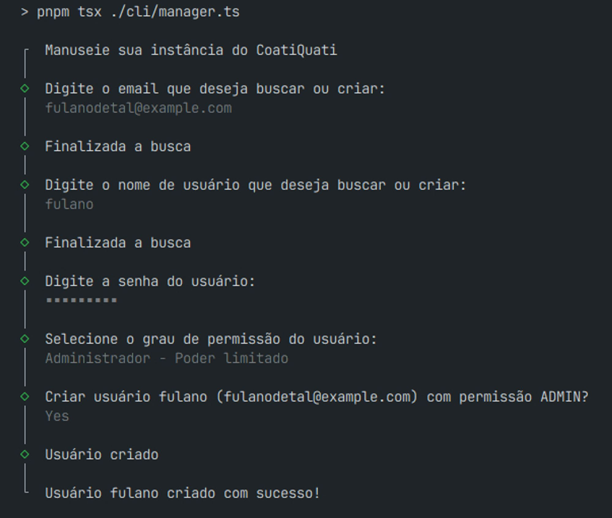
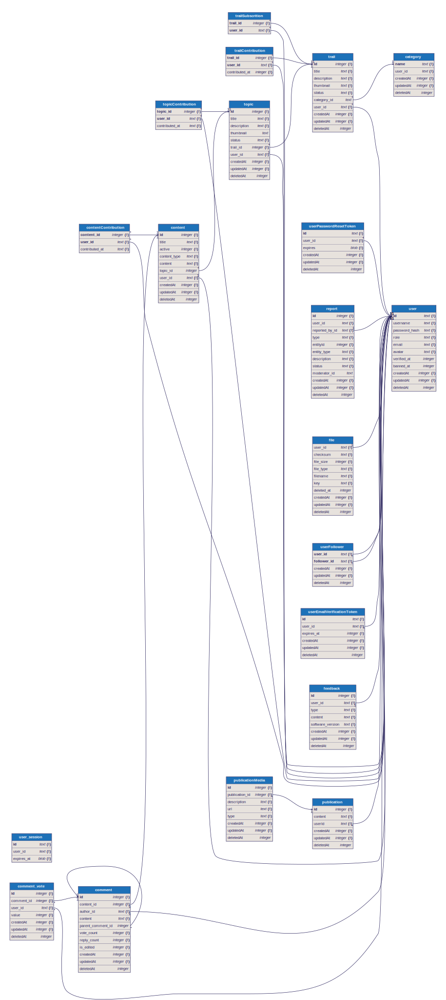

# COATIQUATI - Quase uma rede social, sempre uma ferramenta de aprendizado

CoatiQuati é uma rede social de compartilhamento de conhecimento, onde você pode compartilhar seus conhecimentos com o mundo e aprender com a comunidade.

A ideia do CoatiQuati é ser uma ferramenta de aprendizado com trilhas e tópicos de estudo criados por professores que servem como administradores da plataforma.

Futuramente pretendo adicionar funcionalidades que dão ainda mais liberadade aos estudantes, como a possibilidade de criar trilhas de estudo e tópicos de estudo sem a necessidade de ser um professor.

Tudo por aqui é gratuito, sem anúncios e sem rastreamento de dados. Apesar que talvez eu adicione alguma forma de analytics para saber como as pessoas estão utilizando a plataforma, mas pretendo ser transparente sobre isso e procurar uma plataforma de analytics que respeite a privacidade dos usuários.

## EXECUTANDO O PROJETO

### Pré-requisitos

- [Node.js](https://nodejs.org/en/)
- [PNPM](https://pnpm.io/)
- [TURSO](https://turso.tech/)
- [AWS s3](https://aws.amazon.com/pt/s3/)
- [AWS ses](https://aws.amazon.com/pt/ses/)

### Instalação

1. Clone o repositório

   ```sh
   git clone https://github.com/devlulcas/coatiquati.git
   ```

2. Instale as dependências

   ```sh
    pnpm install
   ```

3. Crie um arquivo `.env.local` na raiz do projeto e adicione as seguintes variáveis de ambiente

   ```sh
    cp .env.example .env.local
   ```

4. Altere as variáveis de ambiente no arquivo `.env.local` com as suas credenciais da AWS, banco de dados e etc.

- AWS_ACCESS_KEY_ID = Chave de acesso de um usuário IAM com permissões de acesso ao S3 e SES da AWS
- AWS_SECRET_ACCESS_KEY = Chave secreta de um usuário IAM com permissões de acesso ao S3 e SES da AWS
- AWS_REGION = Região da AWS
- AWS_BUCKET_NAME = Nome do bucket do S3 ({prod|dev|staging}-{domaintld}-{version}-{nanoid})
- DATABASE_URL = URL de conexão com o banco de dados (libsql://{database}-{user}.turso.io ou http://127.0.0.1:8080)
- DATABASE_AUTH_TOKEN = Token de conexão com o banco de dados (Não é necessário para o banco de dados local)

> Para gerar o banco de dados local instale a CLI do Turso e execute `turso dev --db-file dev.db` ou simplesmente `pnpm db:summon`

5. Execute as migrations

   ```sh
    pnpm run db:migrate
   ```

6. Inicie o servidor

   ```sh
    pnpm dev
   ```

7. Acesse o servidor em `http://localhost:3000`

### CLI

#### Administrador

- `pnpm cli:manage` - Inicia o gerenciador do CoatiQuati

Atualmente o gerenciador do CoatiQuati só suporta a criação de contas e alteração de privilégios de usuário.



#### Banco de dados

- `pnpm db:summon` - Inicia o banco de dados local
- `pnpm db:destroy` - Destrói o banco de dados local
- `pnpm db:generate` - Cria uma nova migration
- `pnpm db:migrate` - Executa as migrations
- `pnpm db:push` - Altera o banco de dados sem criar migrations, usar somente em dev
- `pnpm db:pull` - Puxa a estrutura do banco de dados

### Trocando AWS SES por outro serviço de envio de e-mails

1. Altere o arquivo `src/env.ts` e remova as checagens das variáveis de ambiente `AWS_ACCESS_KEY_ID`, `AWS_SECRET_ACCESS_KEY` e `AWS_REGION` (ou mantenha as variáveis de ambiente e altere o valor delas para as credenciais do serviço de envio de e-mails que você deseja utilizar se ele for compatível com o SES, talvez seja necessário mantê-las caso vá usar o S3 da AWS)

2. Altere o arquivo `/src/modules/email/lib/mail.ts` e crie uma nova função que seja compatível com a interface `MailTransporterFactory` e altere a condição `export const mailer` para retornar a função que você criou

Desde que sua implementação seja compatível com a interface `MailTransporterFactory` você pode usar qualquer serviço de envio de e-mails que desejar.

### Trocando AWS S3 por outro serviço de armazenamento de arquivos

> [!WARNING]
> O serviço de armazenamento de arquivos deve ser compatível com o S3 da AWS. Se você deseja usar um serviço de armazenamento de arquivos que não seja compatível com o S3 da AWS você deve alterar o código fonte do projeto para que ele seja compatível com o serviço de armazenamento de arquivos que você deseja utilizar.

1. Garanta que o serviço de armazenamento de arquivos que você deseja utilizar seja compatível com o S3 da AWS (o que é bem provável)

2. Altere as variáveis de ambiente `AWS_ACCESS_KEY_ID`, `AWS_SECRET_ACCESS_KEY` e `AWS_REGION` no arquivo `.env.local` para as credenciais do serviço de armazenamento de arquivos que você deseja utilizar

> Você pode alterar o código fonte do projeto para que ele seja compatível com o serviço de armazenamento de arquivos que você deseja utilizar

### Adicionando login com redes sociais

Para isso talvez seja necessário alterar o código fonte do projeto, pois o projeto atualmente só suporta login com e-mail, usuário e senha.

Você provavelmente terá que alterar o banco de dados também.

Para implementar essa funcionalidade você pode acessar a documentação da biblioteca de autenticacão que o projeto utiliza [Lucia](https://lucia-auth.com/tutorials/github-oauth/) e ver um [exemplo no github](https://github.com/lucia-auth/examples/tree/main/nextjs-app/github-oauth)

## LICENÇA

MIT License

## CONTATO

[Lucas Alves Rego no Linkedin](https://www.linkedin.com/in/lucas-alves-rego/)
[lucasalvesrego.com no meu site](https://lucasalvesrego.com/)

## Funcionalidades futuras

- [ ] Adicionar login com redes sociais (Bluesky? - No momento não vai rolar fazer isso)
- [x] Adicionar suporte a outros serviços de armazenamento de arquivos (Basta implementar outros adaptadores)
- [ ] Suporte a criação de conteúdo com markdown, além do WYSIWYG
- [ ] Suporte a upload de LaTeX para papéis científicos
- [ ] Suporte a upload de arquivos de áudio para micro-podcasts
- [ ] Suporte a upload de arquivos PDF para artigos científicos e livros (com visualizador de PDF)
- [ ] Sistema de tags para categorizar conteúdo automaticamente

### Prioridades

- [x] Suporte a criação de contas de administrador via CLI
- [x] Acessibilidade: Fonte para dislexia
- [-] Ajustes na edição de conteúdo (auto-save, marcação de conteúdo como editado, rascunho local)
- [ ] Nova tela de perfil com informações sobre o usuário
- [ ] Permitir que professores adicionem "prompts" para os alunos escreverem sobre
- [ ] Sinalizar conteúdo inapropriado para remoção
- [ ] Denunciar usuários por comportamento inadequado
- [ ] Feed de amigos (seguindo) cronológico
- [ ] Acessibilidade: Alto contraste (dark mode)
- [ ] Feed "Para você" com base no seu histórico de leitura, tags favoritas, upvotes, downvotes e comentários
- [ ] Ferramenta: Pomodoro
- [ ] Ferramenta/Conteúdo: Flashcards
- [ ] Ferramenta/Conteúdo: Quiz
- [ ] Ferramenta/Conteúdo/Conteúdo: Integração com o [Excalidraw](https://docs.excalidraw.com/docs/@excalidraw/excalidraw/api/props/excalidraw-api)
- [ ] Ferramenta: Anotações
- [ ] Grupos de estudo
- [ ] Ferramenta: Calendário de estudos

## Algoritmo de recomendação de conteúdo para o feed "Para você"

O algoritmo de recomendação de conteúdo para o feed "Para você" será baseado em um sistema de recomendação colaborativo com filtragem colaborativa baseada em itens.

Ainda preciso estudar mais sobre a implementação desse algoritmo, mas a ideia é que a sua rede de amigos, tags favoritas, upvotes, downvotes e comentários sejam usados para recomendar conteúdo para você.

[TensorFlow.js](https://www.tensorflow.org/js) parece ser uma boa opção para implementar esse algoritmo.

## Mais sobre as ferramentas utilizadas

- [Next.js](https://nextjs.org/)
- [Turso](https://turso.tech/)
- [Lucia](https://lucia-auth.com/)

## Banco de dados


